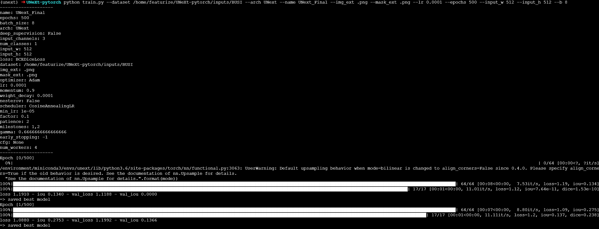
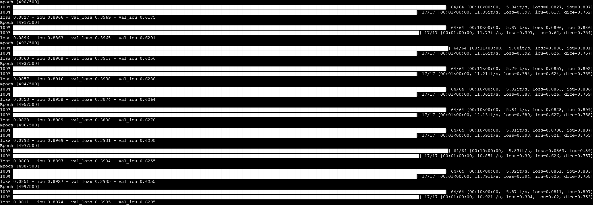
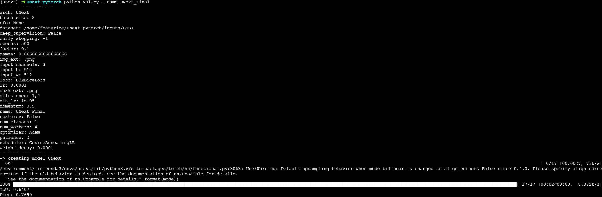

# 复现UNeXt

## 配置：

论文要求 Python 3.6.13, CUDA >=10.1 代码才能稳定运行

克隆存储库：
```bash
git clone https://github.com/jeya-maria-jose/UNeXt-pytorch
cd UNeXt-pytorch
```

安装依赖包：

```bash
conda env create -f environment.yml
conda activate unext
```

实际上，在服务器上运行代码时会因为environment.yml不完整而产生报错，下面给我的解决方案：

```bash
conda install pandas==1.1.5 -y
pip install albumentations==0.5.2 opencv-python-headless==4.5.1.48 --no-deps
pip install imgaug==0.4.0
conda install scikit-learn=0.24.2 -y
conda install tqdm -y
```

依次安装上述依赖，即可补全environment.yml的缺失。

在准备好依赖后，代码任然不能运行，看报错知GPU/PyTorch/CUDA版本不匹配。原因是作者在environment.yml指定pytorch的版本为1.7.1（支持的 GPU 架构是 sm_37, sm_50, sm_60, sm_70, sm_75），而我使用的显卡是sm_86架构，我的解决方案是换服务器，新的服务器GPU是2080ti，20系显卡使用sm_75架构从而与pytorch1.7.1相兼容，成功运行代码。

## 数据集

1) ISIC 2018 - [Link](https://challenge.isic-archive.com/data/)
2) BUSI - [Link](https://www.kaggle.com/aryashah2k/breast-ultrasound-images-dataset)

我对BUSI数据集整理至以下的数据集存放格式要求，具体就是将原本的BUSI数据集中benign, malignant文件夹(normal文件夹直接扔掉因为原论文中说只用benign和malignant中的647张图片)中的.png文件按照名字中有无mask重新分为两个文件夹images和masks，其中images文件夹中的.png文件重命名为000-647.png，masks文件夹内分为0,1,2三个文件夹，文件夹1内是文件名含有mask_1的.png文件并重命名为001-017.png，文件夹2内是文件名含有mask_2的.png文件并重命名为001.png，文件夹0内是剩余的文件名含有mask的.png文件并重命名为001-647.png，可以看出如果是做语义分割而仅使用masks/0的话，images和mask/0中都有647张照片且一一对应。

将存放格式正确的inputs文件夹（需要在将BUSI文件夹放进inputs中），放在UNeXt-pytorch目录下。

## 数据集存放格式

请确保你的数据集文件夹存放的结构如下：

```
inputs
└── <dataset name>
    ├── images
    |   ├── 001.png
    │   ├── 002.png
    │   ├── 003.png
    │   ├── ...
    |
    └── masks
        ├── 0
        |   ├── 001.png
        |   ├── 002.png
        |   ├── 003.png
        |   ├── ...
        |
        └── 1
            ├── 001.png
            ├── 002.png
            ├── 003.png
            ├── ...
```

如果是语义分割则masks下二级文件夹就一个0；如果是实例分割就是上面所示。

## 模型训练和验证

进入到相应的文件夹后分别进行以下操作:

1. 训练模型
```
python train.py --dataset <dataset name> --arch UNext --name <exp name> --img_ext .png --mask_ext .png --lr 0.0001 --epochs 500 --input_w 512 --input_h 512 --b 8
```
其中--dataset \<dataset name>是数据集路径，--name \<exp name>可以为模型取个名字，–img_ext .png --mask_ext .png要根据具体的图片格式改成png或者jpg

模型训练过程截图
<p align="center">
  
</p>

模型训练结果
<p align="center">
  
</p>

2. 模型评估
```
python val.py --name <exp name>
```
–name \<exp name>这个就是上面自己取的那个名字

模型评估结果
<p align="center">
  
</p>
